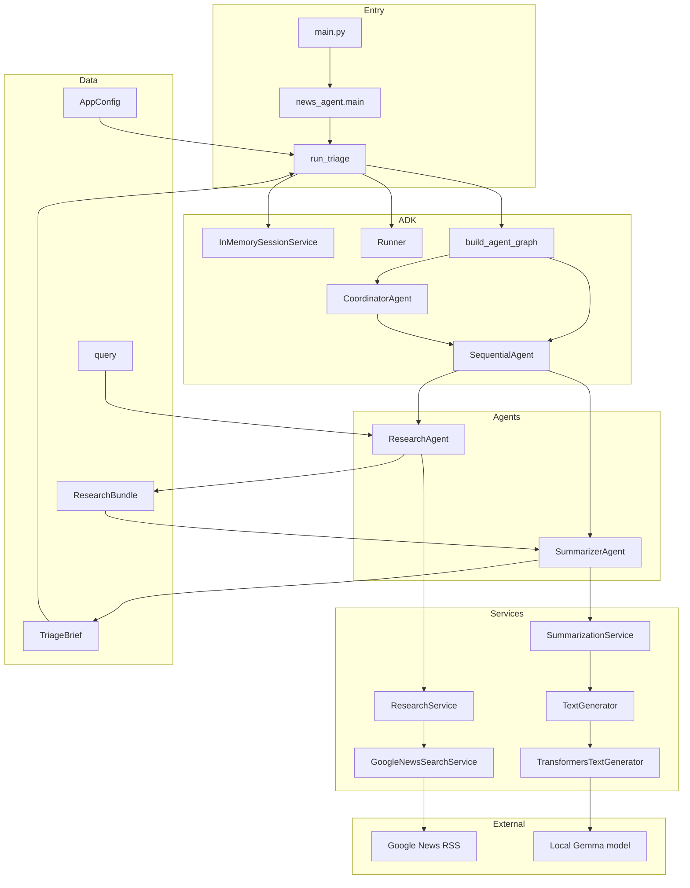
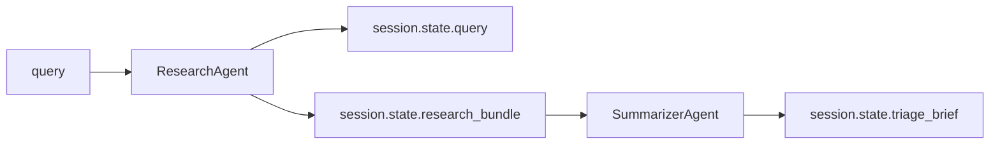

# News Agent

```mermaid
graph TB
    subgraph Entry
        MAIN["main.py"]
        CLI["news_agent.main"]
        RUN["run_triage"]
    end

    subgraph ADK
        SESSION["InMemorySessionService"]
        RUNNER["Runner"]
        BUILD["build_agent_graph"]
        COORD["CoordinatorAgent"]
        PIPE["SequentialAgent"]
    end

    subgraph Agents
        RESEARCH["ResearchAgent"]
        SUM["SummarizerAgent"]
    end

    subgraph Services
        RSVC["ResearchService"]
        SEARCH["GoogleNewsSearchService"]
        SSVC["SummarizationService"]
        GEN["TextGenerator"]
        TGEN["TransformersTextGenerator"]
    end

    subgraph Data
        CFG["AppConfig"]
        QUERY["query"]
        BUNDLE["ResearchBundle"]
        BRIEF["TriageBrief"]
    end

    subgraph External
        NEWS["Google News RSS"]
        MODEL["Local Gemma model"]
    end

    MAIN --> CLI --> RUN
    RUN --> SESSION
    RUN --> RUNNER
    RUN --> BUILD
    CFG --> RUN
    BUILD --> COORD
    BUILD --> PIPE
    PIPE --> RESEARCH
    PIPE --> SUM
    COORD --> PIPE

    QUERY --> RESEARCH
    RESEARCH --> RSVC
    RSVC --> SEARCH
    SEARCH --> NEWS
    RESEARCH --> BUNDLE
    BUNDLE --> SUM

    SUM --> SSVC
    SSVC --> GEN
    GEN --> TGEN
    TGEN --> MODEL
    SUM --> BRIEF
    BRIEF --> RUN
```

```mermaid
graph LR
    Q["query"] --> R["ResearchAgent"]
    R --> S1["session.state.query"]
    R --> S2["session.state.research_bundle"]
    S2 --> Z["SummarizerAgent"]
    Z --> S3["session.state.triage_brief"]
```
