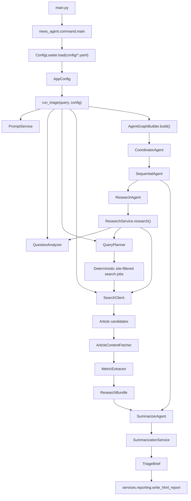
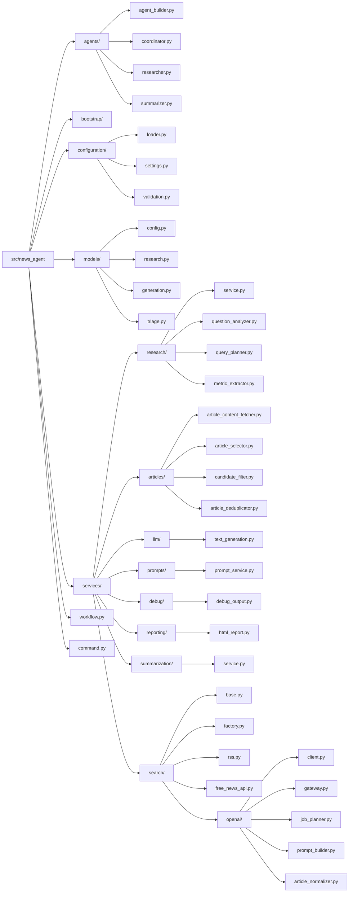
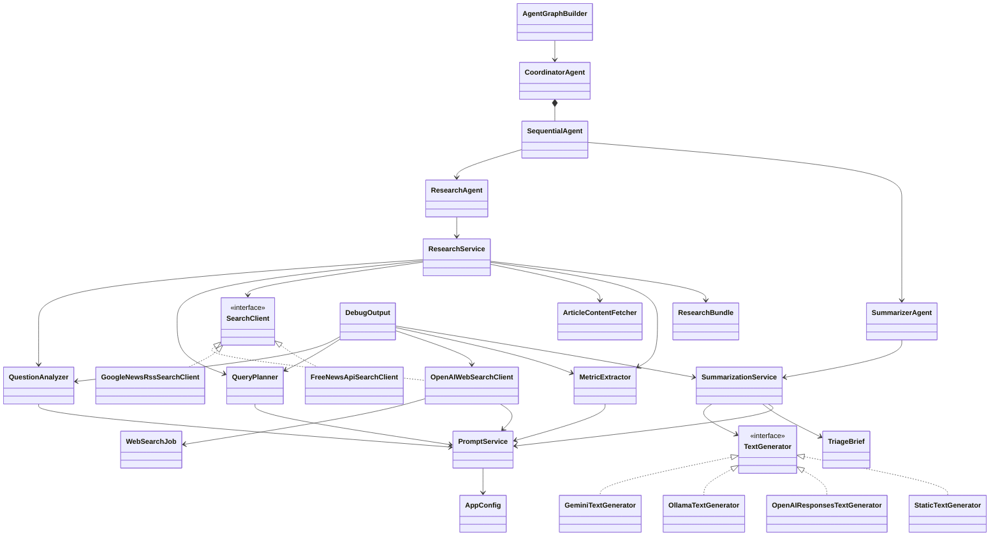
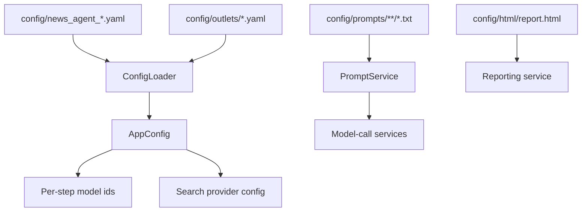
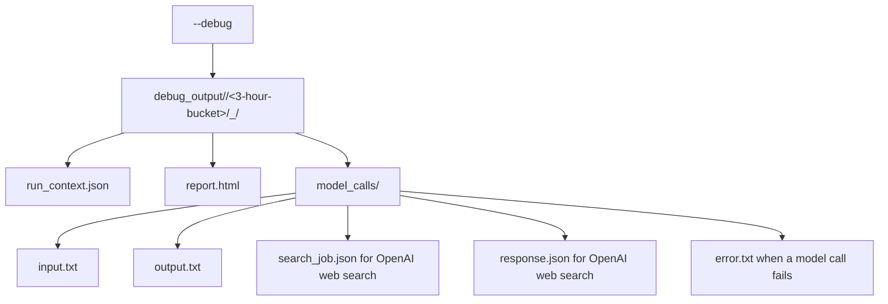

# Architecture

Canonical architecture file for this repo.

## Runtime Flow

## Package Structure

## Core Relationships

## Config And Prompt Flow

## Debug Flow

## Rules

- All dataclasses stay in `models/`.
- Provider-specific implementations stay at the edge under `services/search/`.
- OpenAI web-search internals live under `services/search/openai/`.
- Research workflow pieces live under `services/research/`.
- Summarization lives under `services/summarization/`.
- Article processing pieces live under `services/articles/`.
- Text generation infrastructure lives under `services/llm/`.
- Configuration loading, validation, and resolved settings live under `configuration/`.
- Prompt loading, debug output, and reporting each have focused subpackages.
- Agents do orchestration only; service logic lives in `services/`.
- Prompts live in `config/prompts/`, not embedded in provider code.
- HTML report structure lives in `config/html/report.html`.
- `workflow.py` wires the pipeline and should not contain provider-specific branching.
- Query-specific special cases are not allowed in code; behavior must come from prompts, config, and general services.
