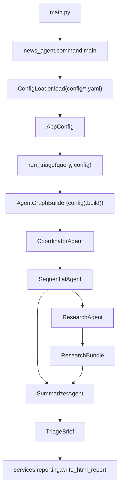
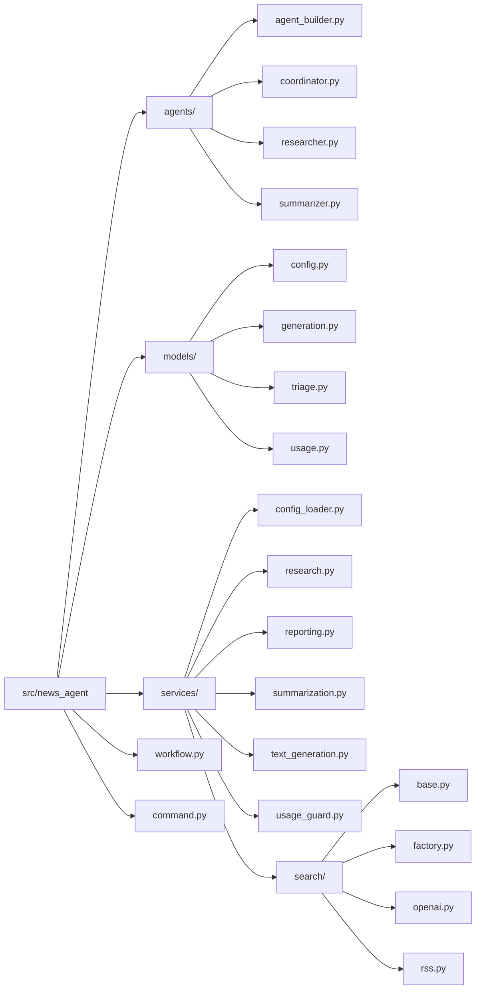
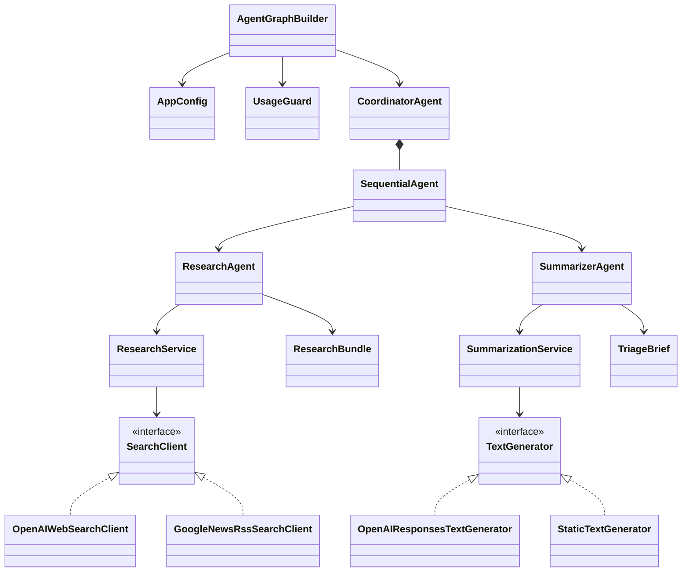

# Architecture

Canonical architecture file for this repo.

## Runtime Flow

## Package Structure

## Core Relationships

## Rules

- All dataclasses stay in `models/`.
- Provider-specific implementations stay at the edge (`services/search/openai.py`, `services/search/rss.py`).
- Agents do orchestration only; service logic lives in `services/`.
- `workflow.py` runs one workflow and should not contain provider-specific branching.
